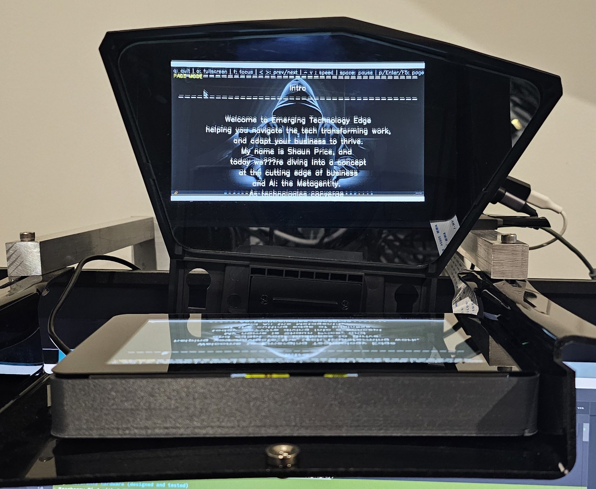
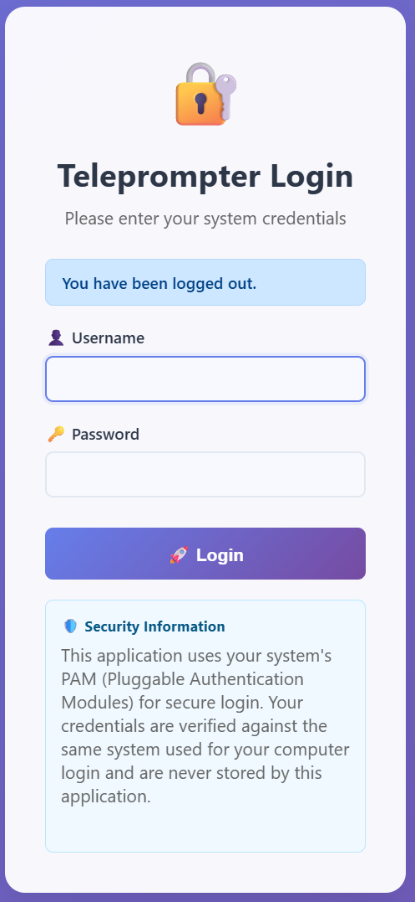
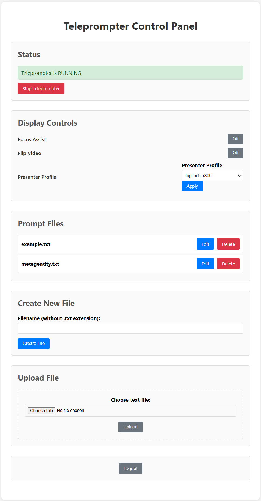
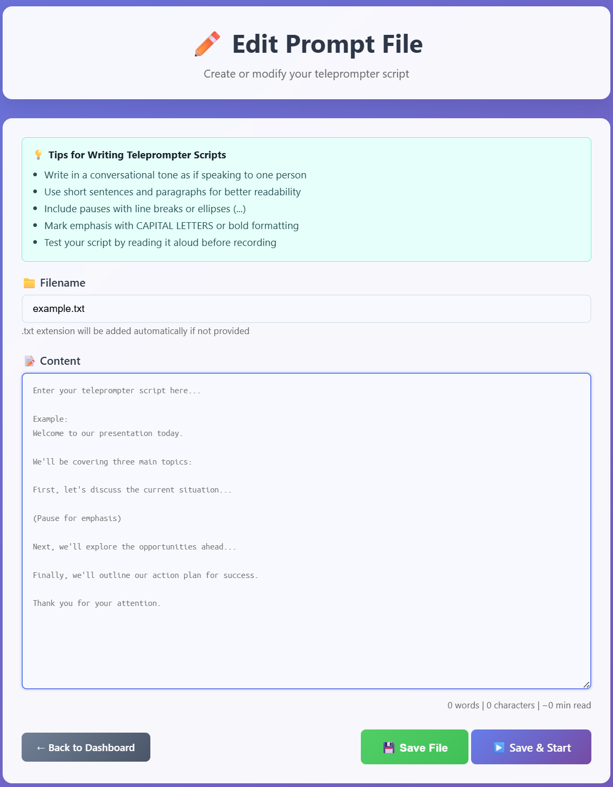

# 🎬 Professional Teleprompter System


Raspberry Pi 4 2G with Touch Screen
Half Morror Teleprompter Screen

A robust, feature‑rich teleprompter application with web‑based management interface, camera overlay, and professional presentation controls.

<em><strong>Note:</strong> The Teleprompter has only been tested on a Raspberry Pi 2G RAM with a Raspberry Pi touch screen.</em>


## 🧪 Reference hardware (designed and tested)
- Raspberry Pi 4 with 2 GB RAM and official 7" touchscreen
- HDMI input via low‑cost HDMI→USB video capture adapter
- Tested with: https://www.amazon.com.au/Portable-Camcorder-Definition-Acquisition-Broadcasting/dp/B08CDSXV47

## ✨ Features

### 🎯 Core Functionality
- Page Mode (default ON) using section markers: a line starting with `========` defines the next page
- Smooth text scrolling with adjustable speed when page mode is OFF
- Camera overlay (presenter view)
- Full‑screen presentation mode
- High‑quality text rendering

### 🌐 Web Interface
- Authentication via PAM on Linux (on Windows/macOS, simple dev auth)
- Create, edit, upload, and delete prompt files
- Remote start/stop of teleprompter sessions
- Live status panel + Display Controls:
  - Focus Assist toggle (default ON)
  - Flip Video (horizontal flip) toggle
  - Web toggles sync to the desktop app via a tiny `runtime_state.json`
  - Presenter Profile selector (auto | generic | logitech_r800); profiles are loaded from `presenters.json`

  <div align="center">

<em>Login Page</em>

<em>Login Page</em>

<em>Login Page</em>
</p>

### 🖥️ Desktop Integration
- Cross‑platform launcher scripts (Windows/macOS/Linux)
- Optional autostart on login

---

## 🚀 Quick Start

### Prerequisites
- Python 3.7 or higher
- Optional webcam for presenter overlay
- System with GUI support

### Installation

#### Option 1 — Automatic Setup (Recommended)

**Linux/macOS**
```bash
git clone <repository-url>
cd teleprompter
chmod +x setup.sh
./setup.sh
```

**Raspberry Pi / Debian (if setup.sh fails)**
```bash
chmod +x setup-pi.sh
./setup-pi.sh
```

**Windows**
```batch
git clone <repository-url>
cd teleprompter
python setup.py
```

#### Option 2 — Manual Setup

1) Create virtual environment
```bash
python -m venv teleprompter-venv
# Activate (Linux/macOS)
source teleprompter-venv/bin/activate
# Activate (Windows)
teleprompter-venv\Scripts\activate
```

2) Install dependencies
```bash
pip install -r requirements.txt
```

3) System headers (Linux)
```bash
# Ubuntu/Debian
sudo apt-get install python3-dev libpam0g-dev
# RHEL/Fedora
sudo yum install python3-devel pam-devel
```

---

## 📖 Usage

### Web Interface (Recommended)

1) Start the web interface
```bash
./start_web_interface.sh          # Linux/macOS
start_web_interface.bat           # Windows
```

2) Open: http://localhost:5000
  - Log in (Linux uses PAM; on Windows/macOS, dev auth accepts any non-empty username/password)
  - Create/edit prompt files and start the teleprompter

### Direct Command Line

```bash
./start_teleprompter.sh prompts/example.txt                 # Linux/macOS
python teleprompter.py prompts/example.txt --windowed       # Cross‑platform
python teleprompter.py prompts/example.txt --no-camera
python teleprompter.py check_keys                           # Presenter key inspector
```

### Keyboard and Presenter Controls

- q: quit
- o: toggle fullscreen
- f: toggle Focus Assist (red Laplacian edges)
- space / esc: pause/resume scrolling
- p / Enter / F5: toggle Page Mode (default ON)
- In Page Mode: Left/Right or PageUp/PageDown jumps to previous/next page (defined by `========` separators)
- When NOT in Page Mode: Left/Right adjusts scroll speed
- k: toggle key logger (prints raw and masked key codes to console; useful for mapping presenter buttons)
  - If running as a service, key logs also append to `teleprompter.log`

---

## 🔧 Configuration

### Command Line Options
```
python teleprompter.py [FILE] [--no-camera] [--windowed]
```

### Web Interface Configuration
Default endpoint is `http://localhost:5000`. To change host/port, edit `web_interface.py`:
```python
app.run(host='0.0.0.0', port=5000, debug=False)
```

### Display Controls (Web)
- Focus Assist: mirrors the in‑app 'f' toggle; default ON
- Flip Video: horizontal flip for the camera/background feed
- State is persisted to `runtime_state.json` and polled by the desktop app (about twice per second)
 - Presenter Profile: select a profile; mappings come from `presenters.json` (generic is built-in and not in the file)

---

## 🖥️ Desktop Integration

### Menu Integration (Linux)
```bash
cp *.desktop ~/.local/share/applications/
update-desktop-database ~/.local/share/applications/
```
macOS: create aliases/shortcuts.  
Windows: right‑click a `.bat` file → **Create Shortcut**.

### Autostart the Web Interface
**Linux**
```bash
mkdir -p ~/.config/autostart
cp teleprompter-autostart.desktop ~/.config/autostart/
```
macOS: add to **Login Items**.  
Windows: `Win+R` → `shell:startup` → copy `start_web_interface.bat`.

---

## 🔄 Raspberry Pi Display Rotation (Wayland / labwc)

When using a Raspberry Pi with the official 7" DSI touchscreen, you may need a permanent rotation (and optional mirroring) for use behind teleprompter glass. The display image and the touch input must both be transformed.

### A) Rotate the Display at Login (labwc)
Create a labwc autostart file and apply a transform to the **DSI-1** output:
```bash
mkdir -p ~/.config/labwc
nano ~/.config/labwc/autostart
```
Example for **180°** rotation (upside‑down):
```sh
#!/bin/sh
wlr-randr --output DSI-1 --transform 180 &
```
- Use `90`, `180`, or `270` for rotation only.
- Use `flipped-90`, `flipped-180`, or `flipped-270` for rotation **plus mirroring**.

Make it executable and reboot (or log out/in):
```bash
chmod +x ~/.config/labwc/autostart
```

### B) Align the Touchscreen (official DSI panel)
Edit the firmware config so touch events map to the rotated screen:
```bash
sudo nano /boot/firmware/config.txt
```
Keep your existing graphics driver line:
```ini
dtoverlay=vc4-kms-v3d
```
Add a **second** overlay line for the 7" DSI panel (examples):
- **180° rotation (no mirror):**
  ```ini
  dtoverlay=vc4-kms-dsi-7inch,invx,invy
  ```
- **90° rotation (no mirror):**
  ```ini
  dtoverlay=vc4-kms-dsi-7inch,swapxy
  ```
- **90° rotation + horizontal mirror (flipped-90):**
  ```ini
  dtoverlay=vc4-kms-dsi-7inch,swapxy,invx
  ```

> Tip: If finger motion feels reversed horizontally/vertically, toggle `invx`/`invy` accordingly.

Reboot to apply:
```bash
sudo reboot
```

---

## 📁 Project Structure
```
teleprompter/
├── teleprompter.py              # Main teleprompter application
├── web_interface.py             # Flask web interface
├── presenters.json              # Presenter mappings (non-generic)
├── setup.py                     # Cross‑platform setup script
├── setup.sh                     # Linux/macOS setup
├── setup-pi.sh                  # Raspberry Pi setup
├── requirements.txt             # Python dependencies
├── README.md                    # This file
├── .gitignore                   # Git ignore rules
├── templates/                   # Web templates
│   ├── index.html
│   ├── edit.html
│   └── login.html
├── prompts/
│   └── example.txt
├── runtime_state.json           # Web <-> desktop state (created at runtime)
├── *.desktop                    # Desktop entries
├── start_*.sh                   # Linux/macOS launchers
├── start_*.bat                  # Windows launchers
└── check_*.sh / .bat            # Hardware test scripts
```

---

## 🔐 Security

### Authentication
- Uses system accounts via PAM (Linux)
- On Windows/macOS, development auth accepts any non‑empty username/password
- No application‑stored passwords
- Secure session management

### Network
- Binds to localhost by default
- No external network required
- Input validation and secure cookies

### Files
- Prompts stored locally in `prompts/`
- File operations restricted to project directories

---

## 🛠️ Troubleshooting

**Camera not working**
```bash
ls /dev/video*
lsof /dev/video0
```

**Presenter remote not mapping keys**
```bash
# Inspect raw key codes (run one of these):
python teleprompter.py check_keys
./check_presenter_keys.bat        # Windows
```
Adjust presenter mappings based on console output if needed.

### Add or adjust a presenter profile
1) Open `presenters.json` and copy an existing block (e.g., `logitech_r800`).
2) Change the key sets using observed codes from the key logger:
  - KEY_*_RAW hold raw codes (from waitKey) for special keys
  - KEY_PREV_ASCII / KEY_NEXT_ASCII hold ASCII key codes for '<' / '>' style keys
3) Save the file; the teleprompter auto-reloads configuration on the fly.
4) In the web UI, pick your profile in Display Controls and click Apply.

**Web login issues**
```bash
cat /etc/pam.d/login
su - yourusername
```

**Performance tips**
- Reduce font size
- Close other camera apps
- Lower scroll speed
- Use windowed mode for testing

**Package installation errors**
```bash
# Linux headers
sudo apt-get install python3-dev libpam0g-dev
# macOS tools
xcode-select --install
# Windows build tools
# Install Visual Studio Build Tools (if required)
```

**Raspberry Pi “externally-managed-environment” error**
```bash
chmod +x setup-pi.sh
./setup-pi.sh
# Or install system packages:
sudo apt install python3-flask python3-opencv python3-numpy python3-pam
```

---

## 🤝 Contributing

1. Fork the repository
2. Create a virtual environment
3. Install development dependencies
4. Make changes with tests/docs
5. Open a Pull Request

### Coding Standards
- PEP 8 style
- Docstrings and type hints
- Tests for new features
- Keep documentation up to date

---

## 📄 License
MIT — see `LICENSE`.

## 🙏 Acknowledgments
- **OpenCV** — computer vision
- **Flask** — web framework
- **python‑pam** — system authentication
- **NumPy** — array processing

## 📞 Support
1. Review this README (Troubleshooting section)
2. Run `./check_presenter_keys.sh`
3. Search existing issues
4. Open a new issue with details

---

**Professional teleprompter solution with web control and presenter support.**
